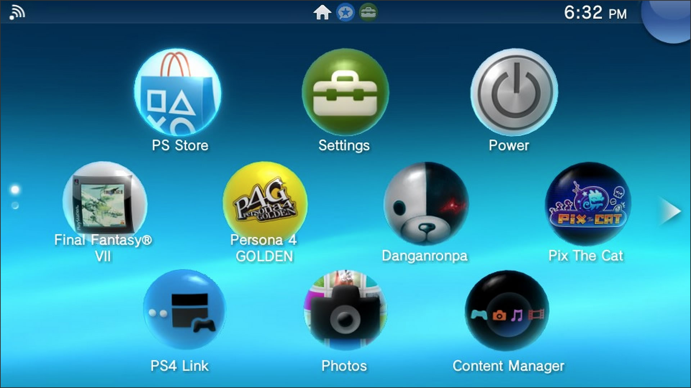
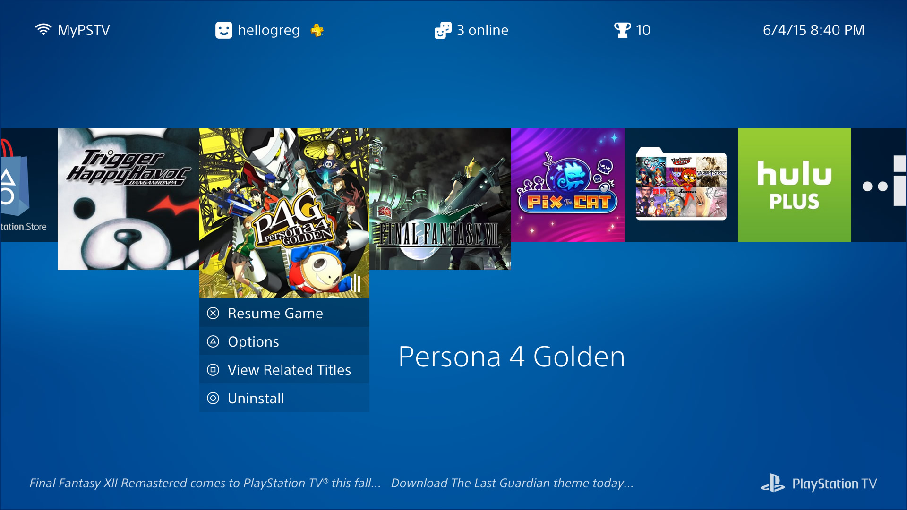
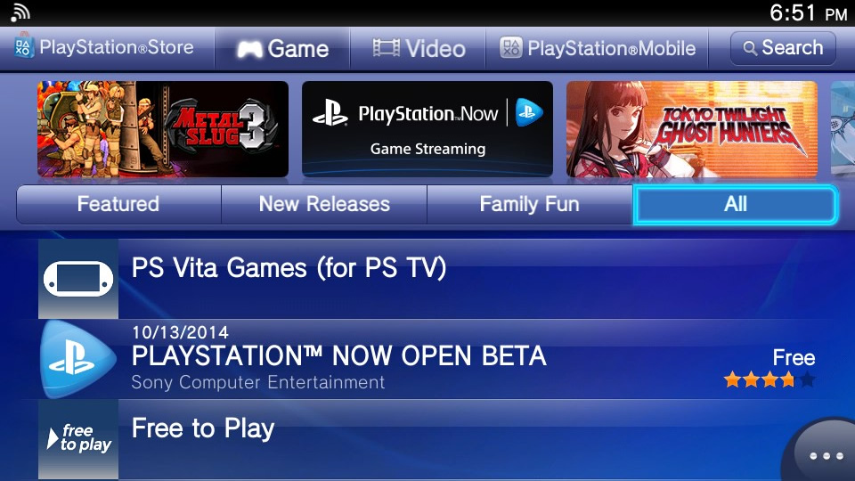
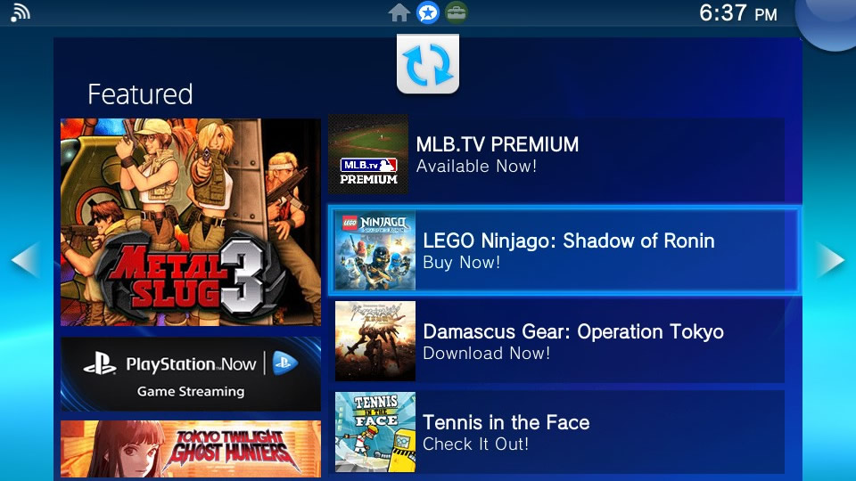
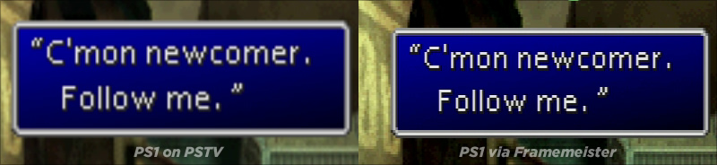

# Reimagining the PSTV (a bit)
######by Greg Gibson ([@elfneedsfood](https://twitter.com/elfneedsfood)). View my PSTV homescreen prototype [here](index.html).

>"We have always been on the cutting edge, never being held back by fear of failure. By taking such an approach to design we give form to innovative concepts and bring them to fruition; creating new standards that turn ideas into global benchmarks."
>-- Sony Design Philosophy: Visionary

I loved the PlayStation TV from [the moment Sony announced it](https://www.youtube.com/watch?v=rG5l78gbvpU).

It was poised to be the Swiss Army knife of PlayStations, giving gamers an opportunity to play titles from every Sony console and handheld ever released (via built-in compatibility, Remote Play, or PlayStation Now). As someone who doesn't do much portable gaming, I looked forward to trying some Vita JRPGs on my TV. And I hoped the PSTV would finally give me the option of playing early-era PlayStation games with an analog stick and some decent upscaling.

It also sounded like the perfect device to bring on long trips: a way to enjoy games and streaming media on the road, making any hotel or guest room feel a little like home.

### What it's been

The PSTV has delivered on some of its promise. I know I got my money's worth just for the opportunity to play through *Persona 4 Golden* and *Danganronpa: Trigger Happy Havoc*. I get more out of my PlayStation Plus membership, now that I receive free Vita games every month. And I can indeed play games like *Final Fantasy VII* and *Xenogears* with the analog stick -- though the upscaling looks rough.

In other ways, the PSTV has disappointed. Its operating system and interface haven't been updated from the Vita's last-generation, touchscreen roots. And the gaming compatibility and streaming media options are limited, sometimes confusingly (if not arbitrarily) so.

For my summer vacation, I’m taking one portable media device with me. If the PSTV had native Netflix, Spotify, and/or YouTube apps, it’d be a no-brainer to take it. But instead, I’m bringing an Amazon Fire TV Stick, so I can watch Netflix and listen to Prime Music.

I think Sony's created a great piece of hardware, but I can't help thinking about how it should be *more* than what it is. It seems compromised, underbaked, and even abandoned in various ways. It feels unloved.

It's hardly been pushed in the US, even though it's both a capable standalone console and a first-class PS4 accessory. Recently, SCEI President and Group CEO Andrew House even referred to the device -- which hasn't even been out for a year in the US -- as a "legacy platform" (though the company later walked that back some).

### What it still can be

I get it. By reducing expectations, Sony is inoculated against the perception that the system has underperformed. I understand that. After the PSTV didn't sell well in Asia, the company felt they shouldn't spend much time or money on upgrading and promoting something they considered dead on arrival in the US.

But I think it's at least worth the small investment of paying one person to be its champion: someone to make the system better and build a case for it inside and outside the company -- for a couple of years, anyway.

Reframe the PSTV the way the Apple framed the Apple TV. Call it "a hobby" for a while, improving how it looks and works. Gradually build a loyal userbase, while still remaining mostly free from sales expectations. See if the media and the public will give it a shot over time, before writing the whole thing off as a failure.

### How I can help

Back in the early 2000s, I led the web development and design for Electronic Arts' experimental online game, Majestic. I now run/am the web department for a large school district (30,000 students and 3,000 employees) in the Chicago area.

I'm used to working as a one-person, low-budget, full-service design and development team. In seeing projects through from concept to conclusion, I'm comfortable working alone, leading small teams, and/or coordinating with other departments. Where I can implement improvements by myself, I'll do so. And when I need to enlist help, I'll do as much up-front work as possible to make everyone else's job easier.

Here are some areas where I could help directly:
 - Redesign the homescreen (to improve the user experience and match current Sony branding).
 - Improve the PlayStation Store interface.
 - Streamline launching and leaving apps.
 - Get rid of the "Featured" tab.
 - Get rid of all the other tabs, too.

And here are other important upgrades that I'd coordinate:
 - Get a Netflix app made (and maybe some other streaming media apps, too).
 - Improve upscaling options for PlayStation Classics.
 - Eliminate the Vita whitelist.

*Note: This isn't a wishlist of every change that could or should be made to the PSTV (e.g., support for cheaper memory cards, improved networking, etc.). I'm just covering some of the software issues where my professional experience could help most quickly. I'd be happy to push for other changes, too, if hired.*

## Fixing the PSTV's User Interface

>"For us, design is more than just superficial look and feel. It must also be in harmony with both the human intellect and instinct. Reaching beyond the realms of functionality and aesthetics, design must provide both an intuitive and enriching experience."
>-- Sony Design Philosophy: Empathy

#####If you want to save yourself some reading and skip right to viewing my PSTV homescreen proof of concept (I won't blame you!), it's here: http://hellogreg.github.io/pstv

The user interface is just a part of the user experience, and a device's homescreen is just a sliver of the user interface. But you have to start somewhere! So, I've redesigned the PSTV's homescreen to accomplish the following:

- Update it to share the same visual branding language as the current generation of Sony products (PS4, Bravia TVs, PlayStation mobile app, etc.).
- Reframe the PSTV as something other than just a Vita on a bigger screen.

Before we get to specifics on the homescreen, I'd like to discuss what the PSTV is -- or, maybe more importantly, what it isn't. Its internals are basically those of a Vita. But a device is not the sum of its component parts. A device is defined by how it’s used.

When the iPad was announced, it was ridiculed as just a big iPhone or iPod touch. Technically, that was true. Its internals were about the same, it shared the same OS, and it ran the same apps. But we now know that calling it a big iPhone was wrong. The iPad was something different, because a tablet is used differently from a phone.

The PSTV is often referred to as just a Vita that plugs into your TV. And again, technically, that’s true, but wrong. Because the PSTV isn’t used in the same places or manner as a Vita, it’s not a Vita. It's not more or less. It's something else.

But the PSTV's current visual interface does look like the Vita’s. In fact it *is* the Vita interface, unaltered.

I'm sure this saved on design and development costs. But, as a result, the PSTV's branding no longer matches the rest of the current generation of Sony’s consumer devices. (For example, the default system typeface is Rodin, the same as on the PlayStation 3.) And the Vita interface was originally designed to display on small screens, meaning that the type size and iconography of the PSTV are often larger than they need to be when displayed on a television.

My biggest issue with the current interface is that it was designed for the Vita's touchscreen navigation, and not a controller, as the PSTV requires. On the PSTV, Button and stick functions change from screen to screen, making them seem like their use was tacked on as an afterthought.

In no single case does this break functionality on the PSTV. But the cumulative effect is annoying. This becomes an obstacle as soon as you reach the console's homescreen.

### The PSTV homescreen, now

For a controller-navigated interface, items should be in a line or a grid. This makes directional pad and analog stick navigation logical and predictable. Up, down, left, and right all correspond to d-pad button presses or analog movements. 

On a touchscreen like the Vita, a grid is less important. That's how we wound up with the current PSTV homescreen, where application icons appear diagonally, from row to row.

With the apps organized like this, trying to move the cursor from row to row is not only unpredictable, but it actually may move in the opposite horizontal direction from what’s intended.

Say you have the top-left application selected. If you press down on the d-pad or analog stick, which second-row app will be selected? It’s the leftmost one, but you’d have no way of knowing that until you actually tried it.

When moving down from the top row, the cursor moves left. When moving down from the middle row, the cursor then moves right. Moving up from the bottom, the cursor moves left. And moving up from the middle, the cursor moves right.

This means there’s no easy way to select the middle row's rightmost app directly from either the top or bottom row. “Unless you use the analog stick,” you may think — as I thought. But that’s not the case.

As mentioned above, if you pull straight down from the top row, the cursor will move to the app down one row and to the left. But if you pull down and to the right… the cursor will still move down and to the left!

Even though the icons aren’t placed in a strict vertical/horizontal grid, the PSTV thinks they are. It thinks the leftmost icons from each row are in a vertical line — and the second from each row, and the third. So, even if you pull down and at a bit of an angle, the cursor moves as if you’d just pulled straight down.

While the layout is just fine for the Vita, on the PSTV, it makes more sense to put the icons in either a true grid, like the PS3’s XMB had, or a line, like the PS4 has.

### The PSTV homescreen, redesigned

To address this, I've designed [a PSTV homescreen proof of concept](index.html), where the look is much like that of the PS4, though with actions for each app mapped to various controller buttons. Navigate right or left to choose an app, and then press the button appropriate for the action you wish to take.

I’ve sized and placed the interface elements on a grid that splits the screen into 64 units horizontally and 36 units vertically. All the apps are sized and placed to fit the grid, and the text's line heights all adhere to it. The only items that don't snap to the grid horizontally are those in the header, where (because the text there can vary by user and time) the items are spaced dynamically for visual balance.

You can view the grid by clicking the “Grid Background” button below the prototype. There are also a few more aesthetic options for you to play with.

I’ve also kept one feature that the PSTV already has that the PS4 doesn’t: folders. When the folder app icon is selected, you can expand it to choose an app within.

### Update the PlayStation Store navigation

Like the homescreen, the store needs a complete overhaul to make it more controller-friendly. (Unlike the homescreen, I haven't designed a prototype for it, yet.) Some of the most important sections -- like the Search area at the top right, and the ellipses at the bottom right -- are the most difficult to access. When they can be tapped on a touchscreen, that's not a big deal. But scrolling and maneuvering around the screen in all directions with a controller to find out how to access them is a pain.

The simplest solution would be to have a left-hand menu, like the other TV-based PlayStation consoles. You always know going left takes you back a level in the hierarchy.

A few other store suggestions:
- My download list should only show titles that can be played on the PSTV. It does me no good to scroll through dozens (hundreds?) of other PlayStation games, apps, etc. to see the small percentage that I actually can use on this system.
- Make a link on the store's homepage that, when followed, shows free games and discounts for PlayStation Plus users. It's near impossible to find them, now.
- Only offer titles that can actually be played on the PSTV. For example, *Touch My Katamari* can be searched, bought, and downloaded. But it won't play. I'm sure I'm not the only person who's bought something that wasn't even compatible.

### Streamline launching and leaving apps.

Say we want to enter the Network section of the PSTV's Settings app. To do so, we'd do the following:

1. Tap X (after selecting the Settings app).
2. Tap X again (to actually start the app from its LiveArea tab).\*
3. Tap X again (to go into Network settings).

Simple enough. But say we want to back out of this section, completely close the Settings app, and then get back to the homescreen? The process should be something like this:

1. Tap Circle.
2. Tap Circle.
3. Tap Circle.

But what you do is this:

1. Tap Circle.
2. Tap the PS Button.
3. Hold Circle (as the LiveArea tab peels from the screen).\*
4. Move left (from the "Featured" tab that now shows onscreen).\*

\* -- *I'll have more to say about these (unnecessary, in my opinion) tabs shortly.*

The first step is optional, if you don't want to revisit the main Settings page. But the process still shouldn't require three or four different actions -- tap circle, tap PS, hold circle, move left -- to do one thing: go back.

This process is another artifact from the Vita. The page peeling makes a lot more sense on a touchscreen, as does the swiping left to get back to the homescreen. On a console, the process should be optimized for the controller: X means go forward, and Circle means go back.

### Get rid of the “Featured” tab

I don't know if anyone ever does anything except skip right past this tab. Nobody likes it. It feels like one of those business decisions made without the user in mind. It breaks navigational flow; you don't see it when entering apps, but it's always there when you leave them. Finally, it looks like too much like it's the store, even though it's not.

If you have to keep this tab (though I don't think you do), at least add store search functionality and/or a direct link to the store's homepage. Honestly, store search functionality wouldn't a bad idea right from the PSTV homescreen.

With no "Featured" tab, there are still ways to promote content to users -- a couple of which I incorporated in [my homescreen redesign](index.html): 

1. Add a marquee to the homescreen (like on the PS3 and PS4). 
2. When a game is highlighted, give users the option to view related titles, themes, and add-ons via a single button press.

Instead of making users dodge a tab they don't want to see, give them rapid access to purchasing content that actually interests them!

### Hell, get rid of *all* the tabs

The interstitial LiveArea screens (the screens where you have to click to start an app after you've already clicked to start the app) are another relic of a touch-based interface. They work well for tapping and swiping, but don't suit controllers.

Instead, when an app is selected on the homescreen, use the controller buttons (e.g., X to start or resume, triangle to bring up a submenu of options, etc.) to replace the LiveArea functions. Also, use an animated icon to signify suspended games and apps, like the PS4 does. I incorporated these features into my [homescreen proof of concept](index.html).

## Other Unsolicited Additions (And Subtractions)

>"Through a relentless process of considered refinement, we determine the distinct essence. Expressed in its clearest and most beautiful form, this essence symbolizes what we strive to achieve in all our design."
>-- Sony Design Philosophy: Integrity

### Add Netflix, ASAP
The PSTV doesn’t need to be an Apple TV or Amazon Fire or even a Chromecast. But it does need to have Netflix.

I've probably got about a dozen devices in my house on which I can watch Netflix. So why do I need another?

Maybe I don't *need* it. But the PSTV does, in part for the same reason some hotels have pools they know will rarely be used. People often make decisions based on what they think they *might* do. If you take away an option, you could lose potential customers.

Also, it is nice to have -- just in case. Being able to switch right from a game to movie without turning off my device or changing inputs on my TV is a convenient perk. I know that it's up to Netflix to make their PSTV app, but I'm sure that Sony, if they wanted, could persuade or pay them to get it done -- even if it's just a matter of making the Vita version compatible.

(It wouldn't hurt to have Spotify, Twitch, and YouTube, too. Glad Hulu's already in!)

### Make the PSTV *the* console for PlayStation Classics

#####To see how a PS1 retro mode might look with nearest-neighbor upscaling and scanlines, [my prototype](index.html) includes a couple of mockups to demonstrate current and proposed looks for *Xenogears* and *Ridge Racer*.

One way to help ensure that the PSTV gains, at the very least, a devoted cult following would be to make it the best way to experience (or re-experience) PlayStation Classics.

Nowadays, more and more people (like me) are spending hundreds of dollars to import devices like the [Framemeister](http://retrogaming.hazard-city.de/framemeister.html), which optimize old CRT-era games for display on HDTVs. Rather than stretching and blurring the games, these devices upscale them faithfully -- maintaining the aspect ratio and keeping all the color and detail. These devices even offer the option of adding scanlines, to make the game look more like it would have on a classic CRT monitor.

The PSTV could take the old 320×240 pixel PlayStation Classics and upscale them to 960×720 (pillarboxed on a 720p TV) or 1280×960 (windowboxed on a 1080p set), depending on TV resolution. There's obviously a market in appealing to gamers' nostalgia. And I know I'd love to have a way to play digital versions of all my old favorites on a console I already have connected to my main TV.

Something the PSTV already has going for it (even over the PS3's PS1 emulation) is that -- as I mentioned at the very beginning of this piece -- games that could originally only be controlled with the d-pad are now compatible with the analog stick.

### Dump the PSTV Whitelist

Give users an option (maybe as an opt-in, so users know the risks) to render *all* Vita games playable -- or at least attempt-able! Just give a clear warning upon purchase or startup that they may not work correctly.

I understand that there could be issues with licensing from third-party publishers. If that's the case, it could be a little trickier to nix the whitelist for those titles. Still, all first-party games should be exempt.

## Colophon

I designed and developed my PSTV proof of concept with HTML, JavaScript, and CSS (via Sass). I do sometimes make chicken scratch sketches to get a rough idea of where I'm headed. But, after that, I prefer prototyping directly in the browser, as opposed to Photoshop or whatever.

With one exception, I didn't use any libraries or frameworks, so almost all the code in that page is mine, from scratch. (The exception is that I used The Financial Times' [FastClick](https://github.com/ftlabs/fastclick) tool, which eliminates delays after tapping links/buttons on mobile devices). The demo should work in the latest versions of all major desktop browsers, I hope!

I also designed this page, though that wasn't as much work. Here, I did use [normalize.css](http://necolas.github.io/normalize.css/) as a style reset. I wrote the text in [Haroopad](http://pad.haroopress.com/), an excellent Markdown editor that exports clean, unstyled HTML.

### Contact me
- **Greg Gibson**
- Email: [hellogreg@gmail.com](mailto:hellogreg@gmail.com)
- Twitter: [@elfneedsfood](https://twitter.com/elfneedsfood)
- NeoGAF: flyover
- PSN: hellogreg

### Resources
- [Sony Design Philosophy](http://www.sony.net/SonyInfo/design/profile/philosophy.html)
- [Sony Feature Design: PS Vita](http://www.sony.net/Fun/design/activity/product/ps_vita/01.html)
- [PSTV User's Guide](http://manuals.playstation.net/document/en/pstv/)
- [PS Vita User's Guide](http://manuals.playstation.net/document/en/psvita/)

### Thanks for reading!
